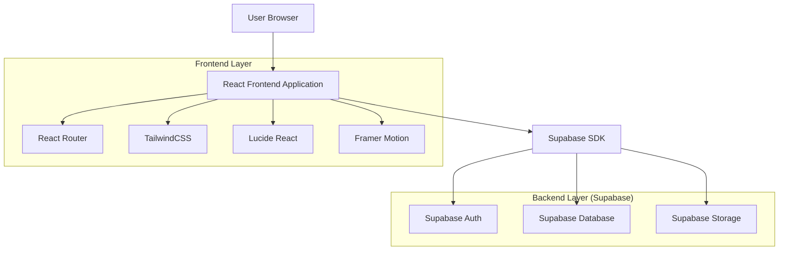

# WindevExpert - Architecture Technique Frontend

## 1. Architecture système



## 2. Stack technologique

- **Frontend :** React@18 + TypeScript + Vite
- **Styling :** TailwindCSS@3 + PostCSS
- **Icons :** Lucide React
- **Animations :** Framer Motion (recommandé pour les animations complexes)
- **Routing :** React Router@6
- **État :** React Context + useState/useEffect
- **Build Tool :** Vite
- **Backend :** Supabase (Auth, Database PostgreSQL, Storage)
- **Hébergement :** Vercel/Netlify (frontend) + Supabase (backend)

## 3. Définition des routes

| Route | Composant | Description |
|-------|-----------|-------------|
| `/` | LandingPage | Page d'accueil avec toutes les sections |
| `/courses` | CoursesPage | Catalogue complet des formations |
| `/course/:id` | CourseDetailPage | Détail d'une formation spécifique |
| `/pricing` | PricingPage | Page des tarifs et abonnements |
| `/login` | LoginPage | Authentification utilisateur |
| `/register` | RegisterPage | Inscription nouvel utilisateur |
| `/dashboard` | DashboardPage | Espace membre principal |
| `/profile` | ProfilePage | Gestion du profil utilisateur |
| `/billing` | BillingPage | Factures et paiements |

## 4. Architecture des composants

### 4.1 Structure des composants

```
src/
├── components/
│   ├── ui/                 # Composants UI réutilisables
│   │   ├── Button.tsx
│   │   ├── Card.tsx
│   │   ├── SectionBadge.tsx
│   │   └── CodeBlock.tsx
│   ├── layout/
│   │   ├── Navbar.tsx
│   │   ├── Footer.tsx
│   │   └── Layout.tsx
│   ├── sections/
│   │   ├── Hero.tsx
│   │   ├── Features.tsx
│   │   ├── Courses.tsx
│   │   ├── Pricing.tsx
│   │   └── TechFeature.tsx
│   └── shared/
│       ├── RevealOnScroll.tsx
│       └── ThemeToggle.tsx
├── pages/
│   ├── LandingPage.tsx
│   ├── CoursesPage.tsx
│   └── DashboardPage.tsx
├── hooks/
│   ├── useAuth.ts
│   ├── useTheme.ts
│   └── useScroll.ts
├── utils/
│   ├── supabase.ts
│   └── animations.ts
└── types/
    └── index.ts
```

### 4.2 Composants UI clés

**Button Component**
```typescript
interface ButtonProps {
  variant?: 'primary' | 'outline' | 'ghost';
  children: React.ReactNode;
  className?: string;
  onClick?: () => void;
  disabled?: boolean;
}
```

**Card Component**
```typescript
interface CardProps {
  title: string;
  description: string;
  icon?: React.ReactNode;
  className?: string;
  hoverEffect?: boolean;
}
```

**RevealOnScroll Component**
```typescript
interface RevealOnScrollProps {
  children: React.ReactNode;
  className?: string;
  delay?: number;
  threshold?: number;
}
```

## 5. Modèles de données

### 5.1 Types TypeScript principaux

```typescript
// User types
interface User {
  id: string;
  email: string;
  name: string;
  avatar_url?: string;
  subscription_plan: 'free' | 'junior' | 'architect' | 'lifetime';
  subscription_status: 'active' | 'inactive' | 'cancelled';
  created_at: Date;
  updated_at: Date;
}

// Course types
interface Course {
  id: string;
  title: string;
  description: string;
  level: 'beginner' | 'intermediate' | 'advanced' | 'expert';
  version: string;
  price: number;
  rating: number;
  students_count: number;
  thumbnail_url: string;
  code_snippet: string;
  duration: number; // in hours
  modules: CourseModule[];
  is_featured: boolean;
  created_at: Date;
}

interface CourseModule {
  id: string;
  course_id: string;
  title: string;
  description: string;
  video_url: string;
  duration: number;
  order_index: number;
  resources: Resource[];
}

interface Resource {
  id: string;
  name: string;
  type: 'download' | 'code' | 'documentation';
  url: string;
  size?: number;
}

// Subscription types
interface Subscription {
  id: string;
  user_id: string;
  plan: 'junior' | 'architect' | 'lifetime';
  status: 'active' | 'inactive' | 'cancelled';
  current_period_start: Date;
  current_period_end: Date;
  cancel_at_period_end: boolean;
  created_at: Date;
}
```

## 6. Configuration Supabase

### 6.1 Tables principales

```sql
-- Users table (extends Supabase auth.users)
CREATE TABLE public.users (
  id UUID REFERENCES auth.users(id) PRIMARY KEY,
  name VARCHAR(100) NOT NULL,
  subscription_plan VARCHAR(20) DEFAULT 'free' CHECK (subscription_plan IN ('free', 'junior', 'architect', 'lifetime')),
  subscription_status VARCHAR(20) DEFAULT 'inactive',
  created_at TIMESTAMP WITH TIME ZONE DEFAULT NOW(),
  updated_at TIMESTAMP WITH TIME ZONE DEFAULT NOW()
);

-- Courses table
CREATE TABLE public.courses (
  id UUID PRIMARY KEY DEFAULT gen_random_uuid(),
  title VARCHAR(200) NOT NULL,
  description TEXT NOT NULL,
  level VARCHAR(20) CHECK (level IN ('beginner', 'intermediate', 'advanced', 'expert')),
  version VARCHAR(20),
  price INTEGER NOT NULL,
  rating DECIMAL(2,1) DEFAULT 0,
  students_count INTEGER DEFAULT 0,
  thumbnail_url TEXT,
  code_snippet TEXT,
  duration INTEGER, -- in minutes
  is_featured BOOLEAN DEFAULT false,
  created_at TIMESTAMP WITH TIME ZONE DEFAULT NOW()
);

-- Course modules table
CREATE TABLE public.course_modules (
  id UUID PRIMARY KEY DEFAULT gen_random_uuid(),
  course_id UUID REFERENCES public.courses(id) ON DELETE CASCADE,
  title VARCHAR(200) NOT NULL,
  description TEXT,
  video_url TEXT,
  duration INTEGER, -- in minutes
  order_index INTEGER NOT NULL,
  created_at TIMESTAMP WITH TIME ZONE DEFAULT NOW()
);

-- User progress tracking
CREATE TABLE public.user_progress (
  id UUID PRIMARY KEY DEFAULT gen_random_uuid(),
  user_id UUID REFERENCES public.users(id) ON DELETE CASCADE,
  course_id UUID REFERENCES public.courses(id) ON DELETE CASCADE,
  module_id UUID REFERENCES public.course_modules(id) ON DELETE CASCADE,
  completed BOOLEAN DEFAULT false,
  completion_percentage INTEGER DEFAULT 0 CHECK (completion_percentage >= 0 AND completion_percentage <= 100),
  last_accessed TIMESTAMP WITH TIME ZONE DEFAULT NOW(),
  created_at TIMESTAMP WITH TIME ZONE DEFAULT NOW(),
  UNIQUE(user_id, module_id)
);
```

### 6.2 RLS Policies (Row Level Security)

```sql
-- Enable RLS
ALTER TABLE public.users ENABLE ROW LEVEL SECURITY;
ALTER TABLE public.courses ENABLE ROW LEVEL SECURITY;
ALTER TABLE public.course_modules ENABLE ROW LEVEL SECURITY;
ALTER TABLE public.user_progress ENABLE ROW LEVEL SECURITY;

-- Users policies
CREATE POLICY "Users can view their own profile" ON public.users
  FOR SELECT USING (auth.uid() = id);

CREATE POLICY "Users can update their own profile" ON public.users
  FOR UPDATE USING (auth.uid() = id);

-- Courses policies (public read for all courses)
CREATE POLICY "Anyone can view courses" ON public.courses
  FOR SELECT USING (true);

CREATE POLICY "Only admins can create courses" ON public.courses
  FOR INSERT WITH CHECK (auth.jwt() ->> 'role' = 'admin');

-- Course modules policies
CREATE POLICY "Anyone can view modules" ON public.course_modules
  FOR SELECT USING (true);

-- User progress policies
CREATE POLICY "Users can view their own progress" ON public.user_progress
  FOR SELECT USING (auth.uid() = user_id);

CREATE POLICY "Users can update their own progress" ON public.user_progress
  FOR ALL USING (auth.uid() = user_id);
```

## 7. Configuration du projet

### 7.1 package.json

```json
{
  "name": "windevexpert-frontend",
  "private": true,
  "version": "0.0.0",
  "type": "module",
  "scripts": {
    "dev": "vite",
    "build": "tsc && vite build",
    "lint": "eslint . --ext ts,tsx --report-unused-disable-directives --max-warnings 0",
    "preview": "vite preview"
  },
  "dependencies": {
    "@supabase/supabase-js": "^2.38.0",
    "framer-motion": "^10.16.0",
    "lucide-react": "^0.294.0",
    "react": "^18.2.0",
    "react-dom": "^18.2.0",
    "react-router-dom": "^6.20.0"
  },
  "devDependencies": {
    "@types/react": "^18.2.37",
    "@types/react-dom": "^18.2.15",
    "@typescript-eslint/eslint-plugin": "^6.10.0",
    "@typescript-eslint/parser": "^6.10.0",
    "@vitejs/plugin-react": "^4.1.1",
    "autoprefixer": "^10.4.16",
    "eslint": "^8.53.0",
    "eslint-plugin-react-hooks": "^4.6.0",
    "eslint-plugin-react-refresh": "^0.4.4",
    "postcss": "^8.4.31",
    "tailwindcss": "^3.3.5",
    "typescript": "^5.2.2",
    "vite": "^4.5.0"
  }
}
```

### 7.2 Configuration Tailwind

```javascript
// tailwind.config.js
/** @type {import('tailwindcss').Config} */
export default {
  content: [
    "./index.html",
    "./src/**/*.{js,ts,jsx,tsx}",
  ],
  darkMode: 'class',
  theme: {
    extend: {
      animation: {
        'blob': 'blob 7s infinite',
        'gradient': 'gradient 8s ease infinite',
      },
      keyframes: {
        blob: {
          '0%': { transform: 'translate(0px, 0px) scale(1)' },
          '33%': { transform: 'translate(30px, -50px) scale(1.1)' },
          '66%': { transform: 'translate(-20px, 20px) scale(0.9)' },
          '100%': { transform: 'translate(0px, 0px) scale(1)' },
        },
        gradient: {
          '0%, 100%': { backgroundPosition: '0% 50%' },
          '50%': { backgroundPosition: '100% 50%' },
        }
      }
    },
  },
  plugins: [],
}
```

## 8. Optimisations et performance

### 8.1 Code splitting
- Lazy loading des pages avec React.lazy()
- Code splitting par route
- Optimisation des images avec lazy loading

### 8.2 Caching strategy
- Cache navigateur pour assets statiques
- Supabase cache pour données fréquentes
- Service worker pour offline (optionnel)

### 8.3 Performance metrics
- First Contentful Paint < 1.5s
- Time to Interactive < 3.5s
- Lighthouse score > 90
- Bundle size < 200KB (gzipped)