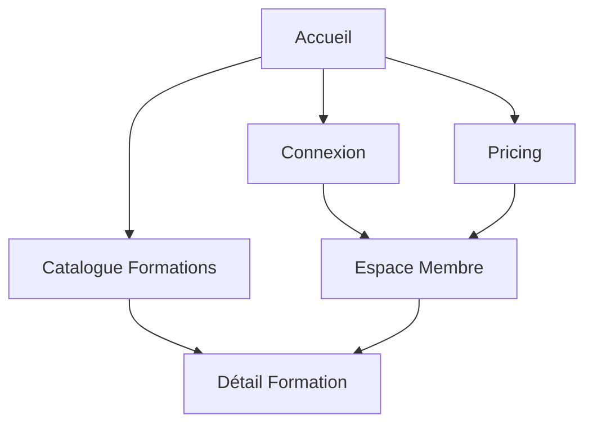

# WindevExpert - Refonte Frontend - Spécifications UI/UX

## 1. Vue d'ensemble du produit

WindevExpert est une plateforme d'apprentissage spécialisée dans l'écosystème PC Soft (WinDev, WebDev, WinDev Mobile). La refonte frontend vise à créer une expérience utilisateur moderne et professionnelle mettant en valeur l'expertise technique de 30 ans dans le domaine.

Objectif : Transformer l'interface existante en une expérience immersive qui convertit les visiteurs en étudiants et fidélise les utilisateurs existants.

## 2. Fonctionnalités principales

### 2.1 Rôles utilisateurs

| Rôle | Méthode d'inscription | Permissions principales |
|------|----------------------|------------------------|
| Visiteur | Navigation libre | Accès aux pages publiques, catalogue formations |
| Utilisateur enregistré | Email + mot de passe | Accès aux formations gratuites, profil utilisateur |
| Abonné | Paiement mensuel/annuel | Accès complet aux formations, téléchargements, Discord privé |
| Expert Lifetime | Paiement unique | Accès à vie + mentorat + certificat |

### 2.2 Modules de fonctionnalités

La plateforme comprend les pages essentielles suivantes :

1. **Page d'accueil** : Hero section avec animation, présentation de la valeur, preuve sociale
2. **Page catalogue formations** : Liste des cours avec filtres et détails
3. **Page détail formation** : Contenu du cours, vidéos, téléchargements
4. **Page espace membre** : Dashboard utilisateur, progression, factures
5. **Page pricing** : Comparaison des offres d'abonnement
6. **Page connexion/inscription** : Authentification et onboarding

### 2.3 Détail des pages

| Page | Module | Description fonctionnelle |
|------|--------|---------------------------|
| Accueil | Navigation | Navbar fixe avec logo animé, menu desktop/mobile, switch thème sombre/clair |
| Accueil | Hero Section | Titre principal avec gradient animé, description, CTA principaux, compteur social |
| Accueil | Visual Player | Mockup de l'interface player avec animations 3D et code source |
| Accueil | Fonctionnalités | Grille 4 colonnes avec icônes et cartes interactives au survol |
| Accueil | Preuve sociale | Bandeau défilement infini avec logos technologies PC Soft |
| Accueil | Problématiques | Section 3 colonnes avec cartes inclinées, focus sur la carte centrale |
| Accueil | Catalogue | Grille 3 colonnes de cours avec aperçu code, notes, prix |
| Accueil | Outil exclusif | Section feature split avec image terminal et liste d'avantages |
| Accueil | Pricing | Comparaison 3 plans avec carte recommandée mise en avant |
| Global | Footer | 4 colonnes avec liens rapides, légal et réseaux sociaux |

## 3. Flux de navigation

## 4. Interface utilisateur

### 4.1 Style de design

**Couleurs principales :**
- Primary : Jaune (#facc15) - Actions, accents, gradients
- Secondary : Indigo (#6366f1) - Éléments techniques, liens
- Dark : Slate (#0f172a) - Fond sombre, texte clair
- Light : Slate-50 (#f8fafc) - Fond clair, texte sombre

**Typographie :**
- Font family : Sans-serif system (Inter/similaire)
- Tailles : 5xl (3rem) pour titres hero, 2xl (1.5rem) pour sous-titres
- Poids : Bold (700) pour titres, Medium (500) pour corps

**Composants :**
- Boutons : Rounded-lg (8px), gradients et ombres portées
- Cartes : Rounded-2xl (16px), bordures subtiles, effets hover
- Animations : Duration-300/500, ease-out, transforms scale/translate

**Icônes :** Lucide React avec tailles standardisées

### 4.2 Vue d'ensemble du design par page

| Page | Module | Éléments UI spécifiques |
|------|--------|------------------------|
| Accueil | Hero | Gradient animé jaune, blobs animés en background, CTA avec icônes |
| Accueil | Player Mockup | Fenêtre terminal avec header macOS, code syntax highlighting |
| Accueil | Features | Cartes avec hover scale-110, bordures colorées, icônes 6x6 |
| Accueil | Problems | Cartes avec rotation différentielle, badge "Focus" animé |
| Accueil | Courses | Cards avec bande latérale colorée, code preview, hover effects |
| Accueil | Tech Feature | Terminal overlay, image perspective, grid pattern background |
| Accueil | Pricing | Cards avec échelle différente, badge "Recommandé", hover translate-y |

### 4.3 Responsive

**Approche :** Desktop-first avec breakpoints :
- Mobile : < 768px (menu hamburger, grilles 1 colonne)
- Tablet : 768px - 1024px (grilles 2 colonnes)
- Desktop : > 1024px (grilles 3-4 colonnes)

**Optimisations tactiles :** Boutons 44px minimum, espacement adapté

### 4.4 Animations et interactions

**Animations clés :**
- Scroll reveal avec IntersectionObserver
- Blob animation CSS 7s infinite
- Gradient animation 8s infinite
- Hover effects : scale, translate, rotation
- Navbar scroll : backdrop-blur et border-bottom
- Mobile menu : slide-in-from-top

**Performance :** GPU-accelerated transforms, will-change optimisé